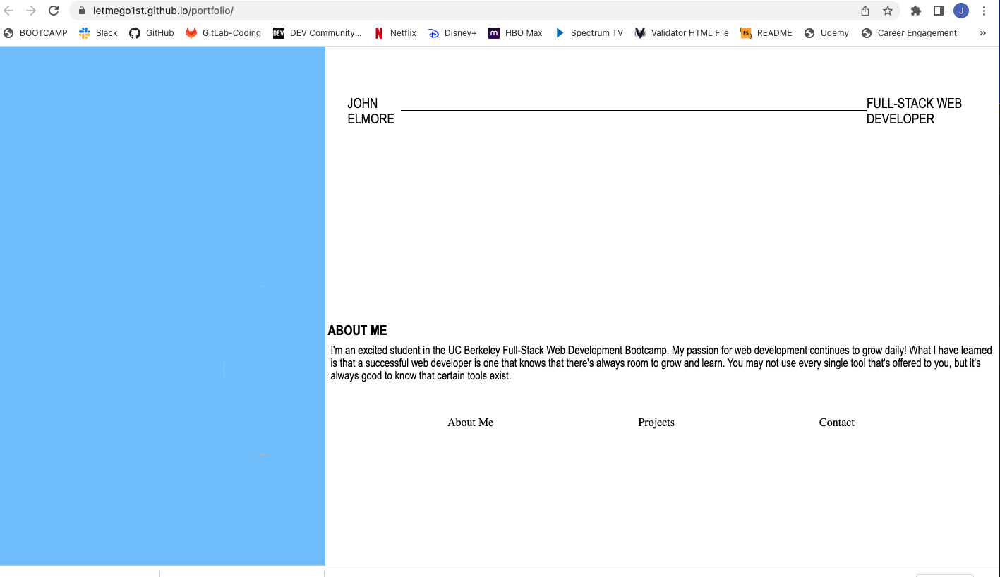

# Portfolio
## John Elmore: Professional Portfolio

For my professional portfolio, I meticulously developed a sample website using HTML, CSS, and JavaScript, which serves as a foundation for my future personal portfolio. Leveraging the knowledge and skills acquired during the prework and initial three weeks of the bootcamp, I crafted the HTML, CSS, & JavaScript code entirely from scratch, adhering to the following criteria:

* Structured Sections: My website is thoughtfully organized into distinct sections, encompassing essential components such as "About Me," "Projects," and "Contact Info."

* Seamless Navigation: To enhance user experience, I implemented fully functional navigation links at the top of the page, allowing visitors to effortlessly navigate to any desired section of the website.

* Resume Inclusion: As I progress through the course, I plan to incorporate a prominent link to my comprehensive resume, ensuring that prospective stakeholders have access to my professional background and achievements.

* Comprehensive Project Showcase: Within the "Projects" section, I showcase a diverse array of programming endeavors. This includes exemplary projects completed during the bootcamp, as well as preliminary applications that will be continuously expanded upon as I tackle further challenges both within the bootcamp curriculum and independently.

* Responsive Design: Recognizing the significance of optimal user experience across various devices, I diligently tailored the website's styling to accommodate multiple screen sizes, including tablets and mobile phones.

* By adhering to these meticulous standards, I aim to present a polished and dynamic portfolio that showcases my skills and accomplishments as I progress in my professional journey.

I invite you to explore my deployed application through the following link:

Please Click Image Below!!!

<!--  -->

<!--  -->

A GIF To Demonstrate The Deployed Portfolio!!

<!--  -->

License
MIT License

Copyright (c) 2023 John Elmore

Permission is hereby granted, free of charge, to any person obtaining a copy of this software and associated documentation files (the "Software"), to deal in the Software without restriction, including without limitation the rights to use, copy, modify, merge, publish, distribute, sublicense, and/or sell copies of the Software, and to permit persons to whom the Software is furnished to do so, subject to the following conditions:

The above copyright notice and this permission notice shall be included in all copies or substantial portions of the Software.

THE SOFTWARE IS PROVIDED "AS IS", WITHOUT WARRANTY OF ANY KIND, EXPRESS OR IMPLIED, INCLUDING BUT NOT LIMITED TO THE WARRANTIES OF MERCHANTABILITY, FITNESS FOR A PARTICULAR PURPOSE AND NONINFRINGEMENT. IN NO EVENT SHALL THE AUTHORS OR COPYRIGHT HOLDERS BE LIABLE FOR ANY CLAIM, DAMAGES OR OTHER LIABILITY, WHETHER IN AN ACTION OF CONTRACT, TORT OR OTHERWISE, ARISING FROM, OUT OF OR IN CONNECTION WITH THE SOFTWARE OR THE USE OR OTHER DEALINGS IN THE SOFTWARE.
